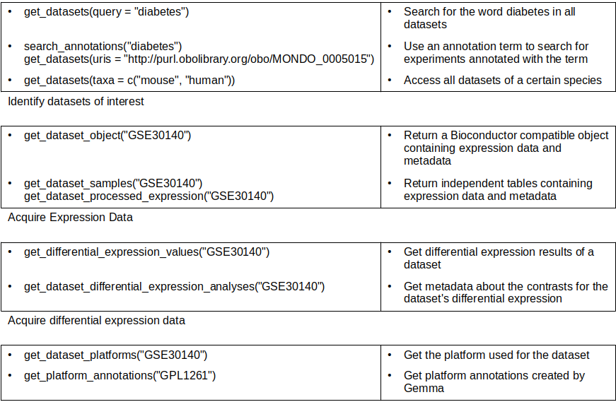

```{r, include = FALSE}
# Prevent certificate issues for GitHub actions
options(gemma.SSL = FALSE,gemma.memoised = TRUE)
# options(gemma.API = "https://dev.gemma.msl.ubc.ca/rest/v2/")
knitr::opts_chunk$set(
    comment = ""
)
```

```{r setup, message = FALSE}
library(gemma.R)
library(data.table)
library(dplyr)
library(ggplot2)
library(ggrepel)
library(SummarizedExperiment)
library(pheatmap)
library(viridis)
library(listviewer)
```

```{r, include = FALSE}
gemma.R:::setGemmaPath('prod')
forget_gemma_memoised() # to make sure local tests don't succeed because of history
```

# About Gemma

[Gemma](https://gemma.msl.ubc.ca/) is a web site, database and a set of
tools for the meta-analysis, re-use and sharing of genomics data,
currently primarily targeted at the analysis of gene expression
profiles. Gemma contains data from thousands of public studies,
referencing thousands of published papers. Every dataset in Gemma has
passed a rigorous curation process that re-annotates the expression
platform at the sequence level, which allows for more consistent
cross-platform comparisons and meta-analyses.

For detailed information on the curation process, read this
[page](https://pavlidislab.github.io/Gemma/curation.html) or the latest
[publication](https://academic.oup.com/database/article/doi/10.1093/database/baab006/6143045).

# Package cheat sheet

{width=100%}

# Installation instructions

## Bioconductor

You can install `gemma.R` through
[Bioconductor](http://bioconductor.org/) with the following code:

```r
if (!require("BiocManager", quietly = TRUE))
    install.packages("BiocManager")

BiocManager::install("gemma.R")
```

# Searching for datasets of interest in Gemma


Using the [`get_datasets`](https://pavlidislab.github.io/gemma.R/reference/get_datasets.html) function, datasets fitting various criteria can be accessed. 

```{r}
# accessing all mouse and human datasets
get_datasets(taxa = c('mouse','human')) %>% 
    select(experiment.shortName, experiment.name, 
           experiment.description,taxon.name) %>%
    head %>% gemma_kable

# accessing human datasets with the word "bipolar"
get_datasets(query = 'bipolar',taxa = 'human') %>% 
    select(experiment.shortName, experiment.name, 
           experiment.description,taxon.name) %>%
    head %>% gemma_kable

# access human datasets that were annotated with the ontology term for the
# bipolar disorder

get_datasets(taxa ='human', 
             uris = 'http://purl.obolibrary.org/obo/MONDO_0004985') %>%
    select(experiment.shortName, experiment.name, 
           experiment.description,taxon.name) %>%
    head %>% gemma_kable
```

Note that a single call of these functions will only return 20 results by default
and a 100 results maximum, controlled by the `limit` argument. In order to get
all available results, use `get_all_pages` function on the output of the function

```{r}
get_datasets(taxa = 'human') %>% 
    get_all_pages() %>% 
    select(experiment.shortName, experiment.name, 
           experiment.description,taxon.name) %>%
    head %>% gemma_kable
```


See [larger queries](#larger-queries) section for more details. To keep this vignette
simpler we will keep using the first 20 results returned by default in examples below.

The `filter` parameter of get_datasets allows filtering for datasets with specific
properties. A list of such properties can be accessed using `filter_properties`.

```{r}
filter_properties()$dataset %>% head %>% gemma_kable()
```

These properties can be used together to fine tune your results

```{r}
# all datasets with more than 4 samples annotated for any disease
get_datasets(filter = 'bioAssayCount > 4 and allCharacteristics.category = disease') %>%
    select(experiment.shortName, experiment.name, 
           experiment.description,taxon.name) %>%
    head %>% gemma_kable

# all datasets with ontology terms for Alzheimer's disease and Parkinson's disease
# this is equivalent to using the uris parameter
get_datasets(filter = 'allCharacteristics.valueUri in (http://purl.obolibrary.org/obo/MONDO_0004975,http://purl.obolibrary.org/obo/MONDO_0005180
)')  %>%
    select(experiment.shortName, experiment.name, 
           experiment.description,taxon.name) %>%
    head %>% gemma_kable
```

Dataset information provided by `get_datasets` also includes some quality information
that can be used to determine the suitability of any given experiment. For instance `geeq.batchEffect` column will be set to -1 if Gemma's
preprocessing has detected batch effects that were unable to be resolved by batch
correction. More information about
these and other fields can be found at the function documentation.

```{r}
get_datasets(taxa = 'human', filter = 'bioAssayCount > 4') %>% 
     filter(geeq.batchEffect !=-1) %>% 
    select(experiment.shortName, experiment.name, 
           experiment.description,taxon.name) %>%
    head %>% gemma_kable
```


Gemma uses multiple ontologies when annotating datasets and using the term URIs instead of
free text to search can lead to more specific results. [`search_annotations`](https://pavlidislab.github.io/gemma.R/reference/search_annotations.html) function
allows searching for annotation terms that might be relevant to your query.

```{r}
search_annotations('bipolar') %>% 
    head %>% gemma_kable()
```


# Downloading expression data

Upon identifying datasets of interest, more information about specific ones 
can be requested. In this example we will be using GSE46416 which includes samples
taken from healthy donors along with manic/euthymic phase bipolar disorder patients.

The data associated with specific experiments can be accessed by using [`get_datasets_by_ids`](https://pavlidislab.github.io/gemma.R/reference/get_datasets_by_ids.html)

```{r dataset}
get_datasets_by_ids("GSE46416") %>%
    select(experiment.shortName, experiment.name, 
           experiment.description,taxon.name) %>%
    head %>% gemma_kable
```

To access the expression data in a convenient form, you can use
[`get_dataset_object`](https://pavlidislab.github.io/gemma.R/reference/get_dataset_object.html).
It is a high-level wrapper that combines various endpoint calls to
return lists of annotated
[`SummarizedExperiment`](https://bioconductor.org/packages/release/bioc/vignettes/SummarizedExperiment/inst/doc/SummarizedExperiment.html)
or
[`ExpressionSet`](https://bioconductor.org/packages/release/bioc/vignettes/Biobase/inst/doc/ExpressionSetIntroduction.pdf)
objects that are compatible with other Bioconductor packages or a
[tidyverse-friendly](https://cran.r-project.org/web/packages/tidyr/vignettes/tidy-data.html)
long form tibble for downstream analyses. These include the expression
matrix along with the experimental design, and ensure the sample names
match between both when transforming/subsetting data.

```{r load-expression, eval = TRUE}
dat <- get_dataset_object("GSE46416",
                          type = 'se') # SummarizedExperiment is the default output type
```

Note that the tidy format is less memory efficient but allows easy
visualization and exploration with
[ggplot2](https://ggplot2.tidyverse.org/index.html) and the rest of the
[tidyverse](https://www.tidyverse.org/).

To show how subsetting works, we'll keep the "manic phase" data and the
`reference_subject_role`s, which refers to the control samples in Gemma
datasets.

```{r}
# Check the levels of the disease factor
dat[[1]]$disease %>% unique()

# Subset patients during manic phase and controls
manic <- dat[[1]][, dat[[1]]$disease == "bipolar disorder,manic phase" | 
        dat[[1]]$disease == "reference subject role"]
manic
```

Let's take a look at sample to sample correlation in our subset.

```{r boxplot, fig.cap="Sample to sample correlations of bipolar patients during manic phase and controls."}
# Get Expression matrix
manicExpr <- assay(manic, "counts")


manicExpr %>% 
    cor %>% 
    pheatmap(col =viridis(10),border_color = NA,angle_col = 45,fontsize = 7)
```

You can also use
[`get_dataset_expression`](https://pavlidislab.github.io/gemma.R/reference/get_dataset_expression.html)
to only get the expression matrix, [`get_dataset_samples`](https://pavlidislab.github.io/gemma.R/reference/get_dataset_samples.html) to get the metadata information. The output of this function can be simplified
to match the version included in the output of `get_dataset_object`  by using [`make_design`](https://pavlidislab.github.io/gemma.R/reference/make_design) on the output.

```{r}
get_dataset_samples('GSE46416') %>% make_design('text') %>% head %>%
    gemma_kable()
```

# Platform Annotations

Expression data in Gemma comes with annotations for the gene each
expression profile corresponds to. Using the
[`get_platform_annotations`](https://pavlidislab.github.io/gemma.R/reference/get_platform_annotations.html)
function, these annotations can be retrieved independently of the
expression data, along with additional annotations such as Gene Ontology
terms.

Examples:

```{r}
head(get_platform_annotations('GPL96') %>% select(-GOTerms))
```

```{r}
head(get_platform_annotations('Generic_human_ncbiIds') %>% select(-GOTerms))
```

If you are interested in a particular gene, you can see which platforms
include it using
[`get_gene_probes`](https://pavlidislab.github.io/gemma.R/reference/get_gene_probes.html).
Note that functions to search gene work best with unambigious
identifiers rather than symbols.

```{r}
# lists genes in gemma matching the symbol or identifier
get_genes('Eno2') %>% gemma_kable()

# ncbi id for human ENO2
probes <- get_gene_probes(2026)

# remove the description for brevity of output
head(probes[,.SD, .SDcols = !colnames(probes) %in% c('mapping.Description','platform.Description')]) %>%
    gemma_kable()

```

# Differential expression analyses

Gemma contains precomputed differential expression analyses for most of
its datasets. Analyses can involve more than one factor, such as "sex"
as well as "disease". Some datasets contain more than one analysis to
account for different factors and their interactions. The results are
stored as resultSets, each corresponding to one factor (or their
interaction). You can access them using
[`get_differential_expression_values`](https://pavlidislab.github.io/gemma.R/reference/get_differential_expression_values.html).
From here on, we can explore and visualize the data to find the most
differentially-expressed genes

Note that `get_differential_expression_values` can return multiple differentials
per study if a study has multiple factors to contrast. Since GSE46416 only has one
extracting the first element of the returned list is all we need.
```{r}
dif_exp <- get_differential_expression_values('GSE46416')
dif_exp[[1]] %>% head %>% gemma_kable()
```

By default the columns names of the output correspond to contrast IDs. To see what
conditions these IDs correspond to we can either use `get_dataset_differential_expression_analyses`
to get the metadata about differentials of a given dataset, or set `readableContrasts` argument
of `get_differential_expression_values` to `TRUE`. The former approach is usually better for
a large scale systematic analysis while the latter is easier to read in an interactive session.

`get_dataset_differential_expression_analyses` function returns structured metadata
about the differentials.

```{r}
contrasts <- get_dataset_differential_expression_analyses('GSE46416')
contrasts %>% gemma_kable()
```

`contrast.ID` column corresponds to the column names in the
output of `get_differential_expression_values` while `result.ID` corresponds to the
name of the differential in the output object. Using them together will let one to access
differentially expressed gene counts for each condition contrast

```{r}
# using result.ID and contrast.ID of the output above, we can access specific
# results. Note that one study may have multiple contrast objects
seq_len(nrow(contrasts)) %>% sapply(function(i){
    result_set = dif_exp[[as.character(contrasts[i,]$result.ID)]]
    p_values = result_set[[glue::glue("contrast_{contrasts[i,]$contrast.ID}_pvalue")]]
    
    # multiple testing correction
    sum(p.adjust(p_values,method = 'BH') < 0.05)
}) -> dif_exp_genes

contrasts <- data.table(result.ID = contrasts$result.ID,
                        contrast.id = contrasts$contrast.ID,
                        baseline.factorValue = contrasts$baseline.factors,
                        experimental.factorValue = contrasts$experimental.factors,
                        n_diff = dif_exp_genes)

contrasts %>% gemma_kable()


contrasts$baseline.factorValue

contrasts$experimental.factorValue
```

Alternatively we, since we are only looking at one dataset and one contrast manually,
we can simply use `readableContrasts`.


```{r diffExpr, fig.cap="Differentially-expressed genes in bipolar patients during manic phase versus controls.", fig.wide=TRUE, warning = FALSE}
de <- get_differential_expression_values("GSE46416",readableContrasts = TRUE)[[1]]
de %>% head %>% gemma_kable

# Classify probes for plotting
de$diffexpr <- "No"
de$diffexpr[de$`contrast_bipolar disorder has_modifier manic phase_logFoldChange` > 1.0 & 
        de$`contrast_bipolar disorder has_modifier manic phase_pvalue` < 0.05] <- "Up"
de$diffexpr[de$`contrast_bipolar disorder has_modifier manic phase_logFoldChange` < -1.0 & 
        de$`contrast_bipolar disorder has_modifier manic phase_pvalue` < 0.05] <- "Down"

# Upregulated probes
filter(de, diffexpr == "Up") %>%
    arrange(`contrast_bipolar disorder has_modifier manic phase_pvalue`) %>%
    select(Probe, GeneSymbol, `contrast_bipolar disorder has_modifier manic phase_pvalue`, 
        `contrast_bipolar disorder has_modifier manic phase_logFoldChange`) %>%
    head(10) %>% gemma_kable()

# Downregulated probes
filter(de, diffexpr == "Down") %>%
    arrange(`contrast_bipolar disorder has_modifier manic phase_pvalue`) %>%
    select(Probe, GeneSymbol, `contrast_bipolar disorder has_modifier manic phase_pvalue`, 
        `contrast_bipolar disorder has_modifier manic phase_logFoldChange`) %>%
    head(10) %>% gemma_kable()

# Add gene symbols as labels to DE genes
de$delabel <- ""
de$delabel[de$diffexpr != "No"] <- de$GeneSymbol[de$diffexpr != "No"]

# Volcano plot for bipolar patients vs controls
ggplot(
    data = de,
    aes(
        x = `contrast_bipolar disorder has_modifier manic phase_logFoldChange`,
        y = -log10(`contrast_bipolar disorder has_modifier manic phase_pvalue`),
        color = diffexpr,
        label = delabel
    )
) +
    geom_point() +
    geom_hline(yintercept = -log10(0.05), col = "gray45", linetype = "dashed") +
    geom_vline(xintercept = c(-1.0, 1.0), col = "gray45", linetype = "dashed") +
    labs(x = "log2(FoldChange)", y = "-log10(p-value)") +
    scale_color_manual(values = c("blue", "black", "red")) +
    geom_text_repel(show.legend = FALSE) +
    theme_minimal()
```

# Larger queries

To query large amounts of data, the API has a pagination system which
uses the `limit` and `offset` parameters. To avoid overloading the
server, calls are limited to a maximum of 100 entries, so the offset
allows you to get the next batch of entries in the next call(s).

To simplify the process of accessing all available data, gemma.R includes the
[`get_all_pages`](https://pavlidislab.github.io/gemma.R/reference/get_all_pages.html) function which can use the output from one page to make all the follow up requests

```{r}
get_platforms_by_ids() %>% 
    get_all_pages() %>% head %>% gemma_kable()
```

Alternative way to access all pages is to do so manually. 
To see how many available results are there, you can look at the
attributes of the output objects where additional information from the
API response is appended.

```{r}
platform_count = attributes(get_platforms_by_ids(limit = 1))$totalElements
print(platform_count)
```

After which you can use `offset` to access all available platforms.

```{r}
lapply(seq(0,platform_count,100), function(offset){
    get_platforms_by_ids(limit = 100, offset = offset) %>%
        select(platform.ID, platform.shortName, taxon.name)
}) %>% do.call(rbind,.) %>% 
    head %>% gemma_kable()
```

Many endpoints only support a single identifier:

```{r error, error = TRUE}
get_dataset_annotations(c("GSE35974", "GSE46416"))
```

In these cases, you will have to loop over all the identifiers you wish
to query and send separate requests.

```{r loop}
lapply(c("GSE35974", "GSE12649"), function(dataset) {
    get_dataset_annotations(dataset) %>% 
        mutate(experiment.shortName = dataset) %>%
        select(experiment.shortName, class.name, term.name)
}) %>% do.call(rbind,.) %>% gemma_kable()
```

# Output options

## Raw data

By default, Gemma API does some parsing on the raw API results to make
it easier to work with inside of R. In the process, it drops some
typically unused values. If you wish to fetch everything, use
`raw = TRUE`. Instead of a data table, you'll usually be served a list
that represents the underlying JSON response.

```{r}
get_gene_locations("DYRK1A") %>% gemma_kable()

get_gene_locations("DYRK1A", raw = TRUE) %>% jsonedit()
```

## File outputs

Sometimes, you may wish to save results to a file for future inspection.
You can do this simply by providing a filename to the `file` parameter.
The extension for this file will be one of three options:

1.  `.json`, if you requested results with `raw=TRUE`
2.  `.csv` if the results have no nested data tables
3.  `.rds` otherwise

You can also specify whether or not the new fetched results are allowed
to overwrite an existing file by specifying the `overwrite = TRUE`
parameter.

## Memoise data

To speed up results, you can remember past results so future queries can
proceed virtually instantly. This is enabled through the
[`memoise`](https://github.com/r-lib/memoise) package. To enable
memoisation, simply set `memoised = TRUE` in the function call whenever
you want to refer to the cache, both to save data for future calls and
use the saved data for repeated calls.

By default this will create a cache in your local filesystem.

You can see the path to your cache by using
`rappdirs::user_cache_dir(appname = "gemmaR")`. If you want to use a
different directory, use `options(gemma.cache = 'path')`.

If you're done with your fetching and want to ensure no space is being
used for cached results, or if you just want to ensure you're getting
up-to-date data from Gemma, you can clear the cache using
[`forget_gemma_memoised`](https://pavlidislab.github.io/gemma.R/reference/forget_gemma_memoised.html).

## Changing defaults

We've seen how to change `raw = TRUE`, `overwrite = TRUE` and
`memoised = TRUE` in individual function calls. It's possible that you
want to always use the functions these ways without specifying the
option every time. You can do this by simply changing the default, which
is visible in the function definition. See below for examples.

```{r defaults, eval = FALSE}
options(gemma.memoised = TRUE) # always refer to cache
options(gemma.overwrite = TRUE) # always overwrite when saving files
options(gemma.raw = TRUE) # always receive results as-is from Gemma
```

```{r,include = FALSE}
options(gemma.memoised = FALSE)
options(gemma.raw = FALSE)

```


# Session info

```{r}
sessionInfo()
```
